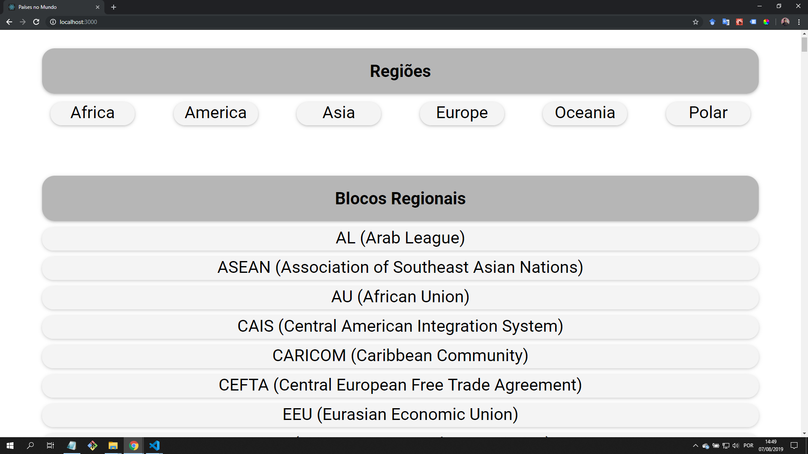
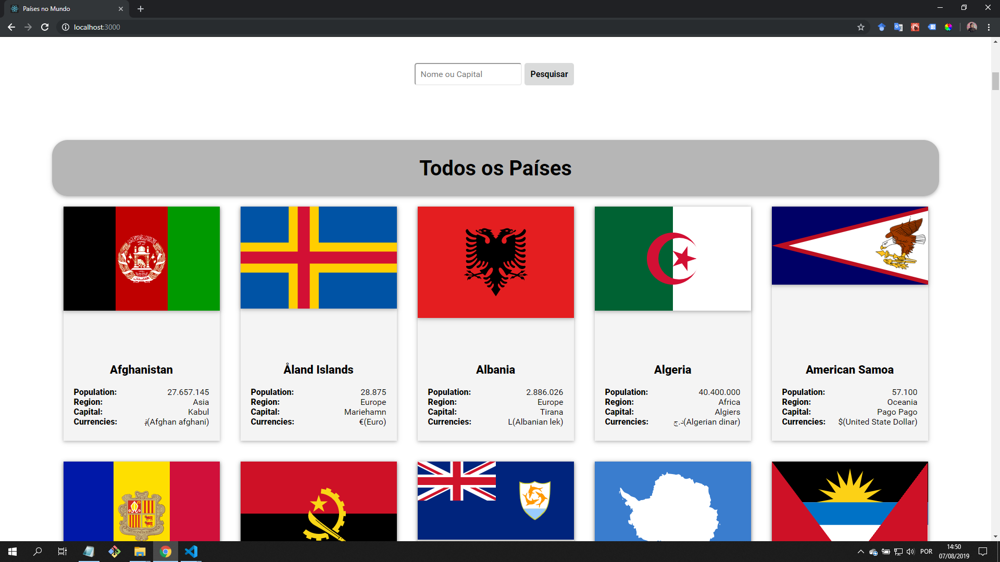
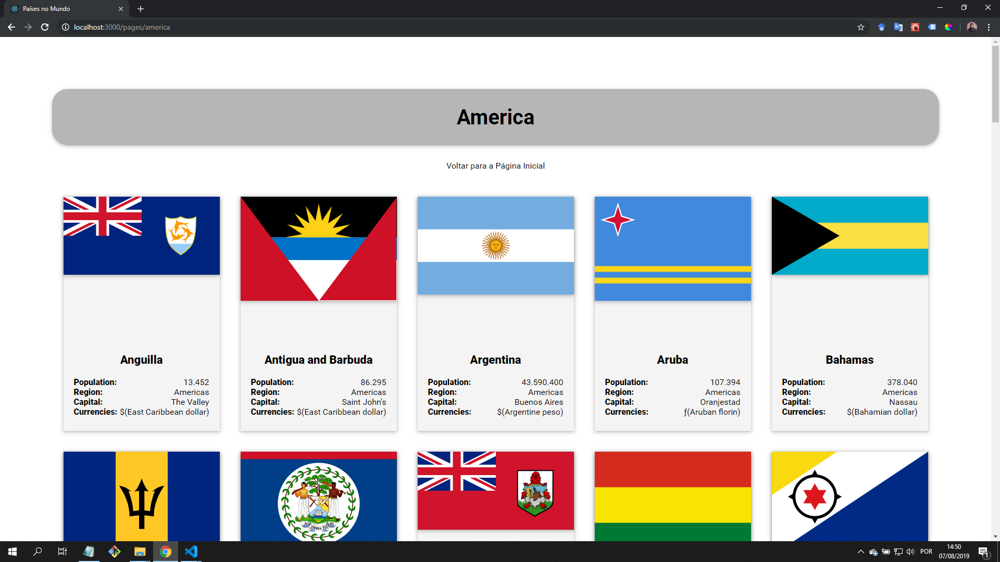
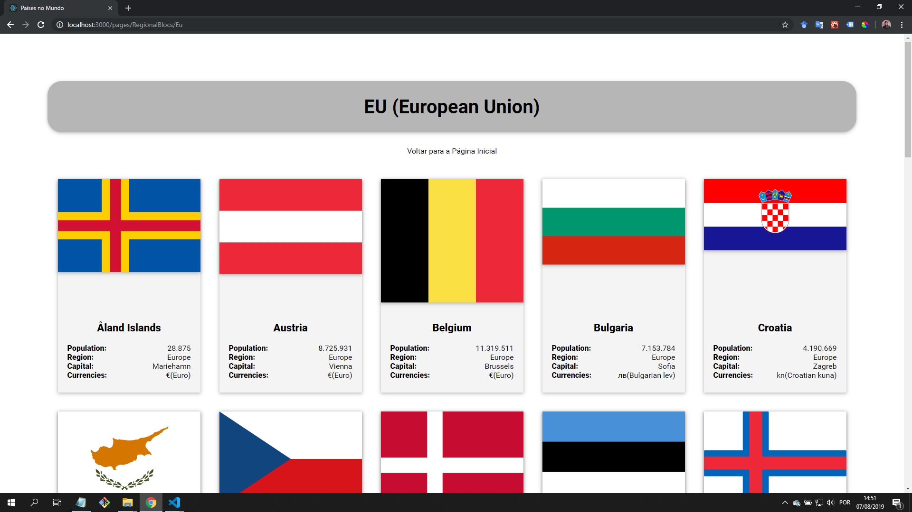

# Instalar os seguintes items:

- npm install
- npm install --save react-router-dom
- npm install node-sass --save
- npm install axios
- npm install formik --save
- npm install @material-ui/core
- npm install @material-ui/icons
- npm i material-components-web

## Após a instalação digitar:
- npm start

## Prints de tela:

# Página inicial
Nesse projeto você deve fazer uma API que mostre informações de países do mundo.
API: https://restcountries.eu
A página inicial deverá ser dividida em 3 partes:

## Lista das regiões

Você deverá apresentar as regiões do mundo disponíveis na API: África, América, Ásia, Europa e Oceania. Ao clicar em uma região, você deve encaminhar o usuário para a Lista de Países com os países da região escolhida.

## Lista de Blocos Regionais

Você deverá apresentar ao blocos Regionais do mundo disponíveis na API: EU, EFTA, CARICOM, PA... Ao clicar em uma região, você deve encaminhar o usuário para a Lista de Países com os países do bloco escolhido

## Busca de países

Você deve permitir que o usuário busque um país por nome ou por capital. Os resultados devem ser exibidos na Lista de Países

# Lista de Países

A lista de países é uma parte do site onde devem ser mostrados a lista dos países baseado num filtro prévio. A lista de países deve conter poucas informações sobre o pais, como bandeira, nome, capital e população. Não traga outros dados além desses na API. Ao clicar em um país, deve mostrar os detalhes sobre o País.

# Detalhe do País

Essa parte deve ser um perfil completo do País. Você apresentar todos os dados que a API devolver e que julgar que são dados que fazem sentido para um usuário final, como população, índice Gini, idioma, área. Abuse de ícones, collapses. Pense em organizar a informação para que tudo fique bem organizado.

# Requisitos

- Esse projeto deve ser entregue via GitHub, utilizando HTML5, React e SaSS. Componentize todos os trechos da página.
- Para estilização, utilize de preferência react-strap ou algum component MaterialDesign.
- Não esqueça de incluir um arquivo README.md com instruções para rodar o seu projeto localmente.
- A aplicação deve ser mobile friendly.

# Desejável

- Utilizar o axios para fazer as chamadas para a API.
- Para a busca de países, você deve usar o component Formik.

# Observações

Você pode pesquisar o quanto quiser na internet e conversar com pessoas do ramo. O importante é que a entrega final seja uma solução feita por você. Você pode inclusive comentar no código os trechos que buscou ajuda e como buscou.

Abuse do seu conhecimento. Procure entregar uma solução mais sofisticada do que o solicitado. Isso com certeza terá um efeito positivo na sua avaliação.

Faça pequenos commits conforme for finalizando as atividades para que possamos acompanhar o seu andamento. Dependendo dos critérios, isso pode ser tão importante quanto a entrega final.

Não se preocupe em entregar as atividades completas. As atividades estão, de maneira proposital, mais difíceis do que seu conhecimento. Sua evolução também será avaliada.